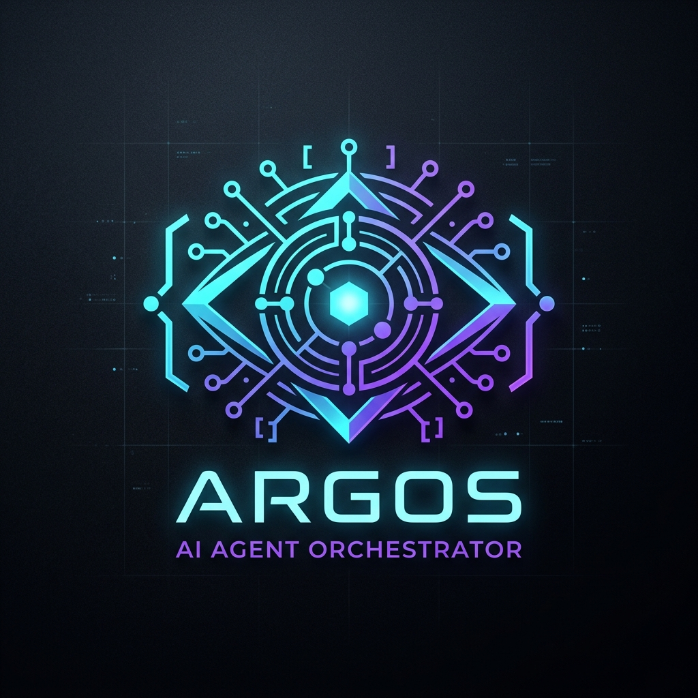

<div align="center">



# ⚡ ServerHelper · Argos（Ἄργος）

**轻量级、低延迟、面向 Coding Agent 的远程多任务并发终端工作台。**

在单个终端里统一管理 Claude Code · Antigravity（`agy`）· Codex / API Agent · 原生 Shell —— 跨多台服务器并发，任务在后台守护进程中持续运行。

[](./LICENSE)
[](https://www.python.org/)
[](./pyproject.toml)
[](#-安装与快速开始)
[](#-为什么需要-serverhelper)
[](#-参与贡献)

<a href="README.md">English</a> · <strong>简体中文</strong>

*灵感源自 OpenCode 与 Pi 的交互美学。*

</div>

---

## 🌟 为什么需要 ServerHelper？

当我们在本地使用 Coding Agent（如 `claude`、Google `agy` 或基于 API 的自定义 Agent）同时连接远程服务器处理多个任务时（例如：一个做推荐系统 `rec` 数据处理，一个做对齐安全评测 `safety`，一个跑持续测试），传统做法通常很痛苦：

1. 本地同时开启 **3~5 个终端黑框**，窗口切换繁琐，容易输错目录或误关任务；
2. 远程配置一套**沉重的 Web/GUI 方案**，消耗大量服务器内存；
3. 本地与远程 Agent **缺乏统一的配置中心与上下文调度**。

**ServerHelper** 采用纯终端 CLI 交互，内存仅占用约 **15MB ~ 35MB**，秒级极速启动。单个统一终端即可管理所有远程与本地任务；任务在后台守护进程中持续运行；并提供类似 OpenCode / Pi 的斜杠命令体验与 Agent 交互桥梁。

---

## ✨ 核心特性

- 🎯 **OpenCode & Pi 风格的交互式 Agent CLI**
  - 输入 `server-helper`（或 `shmux` / `argos`）即可进入沉浸式工作台。
  - 斜杠命令（`/connect`、`/tasks`、`/switch`、`/terminal`、`/agent`、`/status`、`/broadcast`、`/lang` 等），支持 **Tab 自动补全**与方向键导航。
  - 直接输入自然语言需求，无缝分发给指定 Agent 自动化执行。

- 🌐 **中英双语界面（English / 中文）** —— CLI 中用 `/lang` 或 Web 控制台左下角 🌐 按钮即可整体切换语言，选择会持久化；仅影响界面文案，不会改变 Agent 的回复语言。

- 🤖 **支持多 Agent 灵活接入**
  - **Claude Code（`claude`）**：无缝拉起本地或远程交互会话。
  - **Antigravity CLI（`agy`）**：集成 Google Antigravity Agent 执行工作流。
  - **OpenAI / Codex / DeepSeek API（`codex`）**：内置轻量级自主 Agent Loop，支持远程工具（`run_command`、`read_file`、`write_file`、`edit_file`、`list_directory`、`check_gpu_and_system`）。
  - **原生 Shell（`shell`）**：快速挂载原生交互式 SSH / 本地 PTY 终端。

- ⚡ **极致轻量与超低延迟**
  - 启动内存仅 **15MB - 35MB**，极低 CPU 占用。
  - SSH 针对交互延迟深度优化：开启 `TCP_NODELAY`、禁用压缩、优化套接字缓冲区读取。

- 🔄 **会话持久化与后台守护（Daemon）**
  - 所有任务在独立后台线程中运行；退出 CLI 后，远程训练或评测依然在后台持续执行。
  - 重新运行 `server-helper` 并 `/switch <任务名>` 即可秒级重新挂载接管。

- 📢 **多任务全量广播** —— 一键向所有运行中的任务同时下发指令（`/broadcast nvidia-smi`、`/broadcast git pull`）。

- 🖥️ **可选 Web 控制台** —— 浏览器仪表盘，含实时 xterm 终端、Agent 对话面板与 SFTP 文件抽屉。

- 📦 **标准开源可发布规范** —— 现代 `pyproject.toml`（PEP 621）；`pip install -e .` 后即可全局使用 `server-helper` / `shmux` / `argos`。

---

## 📦 安装与快速开始

### 方式一：克隆仓库与本地开发安装（推荐）

```bash
git clone https://github.com/Yandick/argos.git
cd argos

# 使用 uv（推荐，极速）
uv venv
uv pip install -e .

# 或使用标准 venv
python -m venv .venv
# Windows
.\.venv\Scripts\pip install -e .
# Linux / macOS
./.venv/bin/pip install -e .
```

### 方式二：一键运行（Windows）

直接双击 [`start.bat`](./start.bat)，或执行：

```powershell
.\start.ps1
```

### 方式三：一行命令安装

```bash
# Linux / macOS
curl -fsSL https://raw.githubusercontent.com/Yandick/argos/main/install.sh | bash
```
```powershell
# Windows PowerShell
irm https://raw.githubusercontent.com/Yandick/argos/main/install.ps1 | iex
```

---

## ⚙️ 配置文件说明（`setting.json`）

ServerHelper 优先读取工作目录下的 `./setting.json`，若未找到则使用 `~/.server-helper/setting.json`。可复制 [`setting.example.json`](./setting.example.json) 作为起点。

```jsonc
{
  "servers": [
    {
      "name": "gpu-node-1",
      "host": "192.168.1.100",
      "port": 22,
      "user": "ubuntu",
      "auth": "key",                 // "key" 或 "password"
      "key_path": "~/.ssh/id_rsa",
      "default_dir": "/workspace",
      "remote_proxy_port": 10808     // 可选：SSH 反向隧道端口
    }
  ],
  "agents": {
    "default": "claude",
    "claude": { "name": "Claude Code", "cmd": "claude", "type": "cli" },
    "agy":    { "name": "Antigravity CLI", "cmd": "agy", "type": "cli" },
    "codex":  { "name": "OpenAI / Codex API", "api_base": "https://api.deepseek.com/v1", "api_key": "sk-...", "model": "deepseek-chat", "type": "api" }
  },
  "settings": {
    "language": "zh",                // "en" | "zh"
    "theme": "catppuccin",
    "auto_reconnect": true,
    "keepalive_interval": 15
  }
}
```

> 🔒 **安全提示：** `setting.json` 可能包含 SSH 密码，默认已被 **git 忽略**，切勿提交。一旦凭据泄露，请立即更换密码。

---

## 🎮 CLI 交互体验（OpenCode / Pi 风格）

```bash
server-helper      # 或：shmux  /  argos
```

```text
  ▄▀█ █▀█ █▀▀ █▀█ █▀   argos  v0.3.0 · 自主编码 Agent 编排器
  █▀█ █▀▄ █▄█ █▄█ ▄█   Ἄργος Πανόπτης · 多服务器远程工作区框架

  目标:    未连接 (输入 /server 选择目标环境)  空闲
  工作区:  /
  引擎:    agy · gemini-3.8-flash (深度: high)
  代理:    http://127.0.0.1:7897
  主题:    catppuccin

快捷键: /server 目标 · /files 文件 · /sh 终端 · /model 模型 · /help 帮助
```

### 常用指令表

| 命令 | 别名 | 功能说明 | 示例 |
| :--- | :--- | :--- | :--- |
| `/connect` | `/c` `/server` | 交互式选择服务器与工作目录并建立任务 | `/connect` |
| `/tasks` | `/ls` | 查看所有运行中的任务及状态 | `/tasks` |
| `/switch <名称>` | `/sw` | 切换当前活跃工作区上下文 | `/switch safety-eval` |
| `/terminal` | `/sh` | 进入任务的原生交互终端（`Ctrl+]` 脱离） | `/terminal` |
| `/agent <类型>` | | 切换任务的 Agent 引擎（`claude`/`agy`/`codex`/`shell`） | `/agent agy` |
| `/model <名称>` | | 切换活跃 LLM 模型 | `/model gemini-3.8-flash` |
| `/effort <级别>` | | 调节推理深度（`high`/`medium`/`low`/`off`） | `/effort high` |
| `/proxy <url\|off>` | | 配置 HTTP 代理与 SSH 反向隧道 | `/proxy http://127.0.0.1:7897` |
| `/status` | | 查看远程 GPU / CPU / 内存与 Git 状态 | `/status` |
| `/broadcast <命令>` | `/b` | 向所有活跃任务广播执行指令 | `/broadcast nvidia-smi` |
| `/theme <名称>` | | 切换界面配色主题（实时预览） | `/theme tokyo-night` |
| `/lang <en\|zh>` | | 切换界面语言（不带参数则一键互换） | `/lang en` |
| `/close [名称]` | `/stop` | 停止当前或指定任务 | `/close rec-task` |
| `/config` | | 查看当前 `setting.json` 配置 | `/config` |
| `/clear` | | 清屏并重新绘制看板 | `/clear` |
| `/help` | | 完整指令与快捷键指南 | `/help` |
| `/exit` | `/quit` | 退出 CLI（**后台任务不受影响，继续运行**） | `/exit` |

### 自然语言下发

在选定活跃任务后，无需输入斜杠，直接输入即可：

```text
[gpu-node-1: /workspace/safety] argos › 检查当前目录下的评测日志，并排查 OOM 报错
```

---

## 🖥️ 命令行非交互调用（Subcommands）

```bash
server-helper list                                   # 查看所有后台任务
server-helper start safety --server gpu-node-1 --dir /workspace/safety --agent claude
server-helper attach safety                          # 挂接到任务终端
server-helper broadcast "nvidia-smi"                 # 向所有任务广播指令
server-helper stop safety                            # 停止任务
server-helper server list                            # 管理已保存的服务器
server-helper server add node-2 --host 192.168.1.101 --user ubuntu --auth key --key ~/.ssh/id_rsa --dir /workspace
server-helper web --port 8765                        # 启动 Web 控制台
```

---

## 🧪 自动化测试

```bash
python test_agent_cli.py          # 全链路指令与配置读取验证
python test_agent_simulation.py   # Agent 仿真并发压测
```

---

## 🗺️ 路线图

- [ ] 统一根目录模块与 `src/server_helper/`，消除双重实现
- [ ] 可选的 keyring 凭据加密存储
- [ ] Web 控制台基于 token 的认证
- [ ] 更多主题与 Agent 接入

---

## 🤝 参与贡献

欢迎提交 Issue 与 PR。请勿将 `setting.json` 纳入版本控制，并为新行为补充测试。

## 📄 开源许可证

基于 [MIT License](./LICENSE) 开源发布。

---

<div align="center">

<a href="README.md">English</a> · <strong>简体中文</strong>

为「在多台服务器上跑多个 Agent」的人而作 ⚡

</div>
